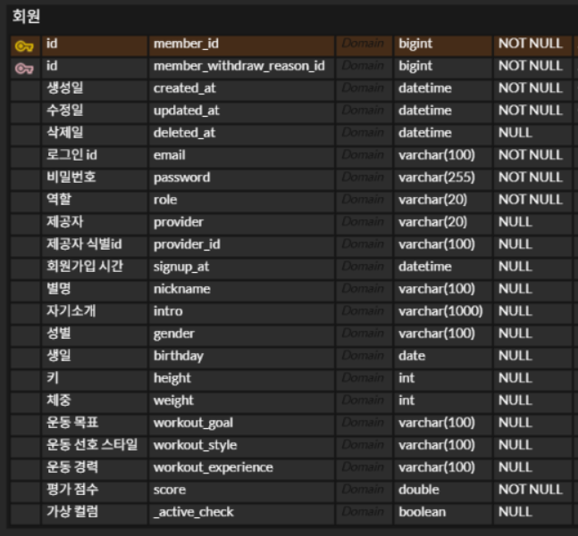
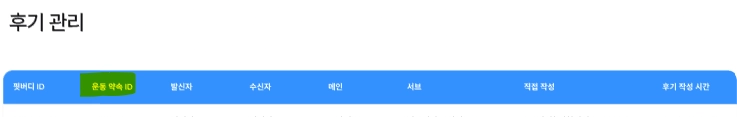
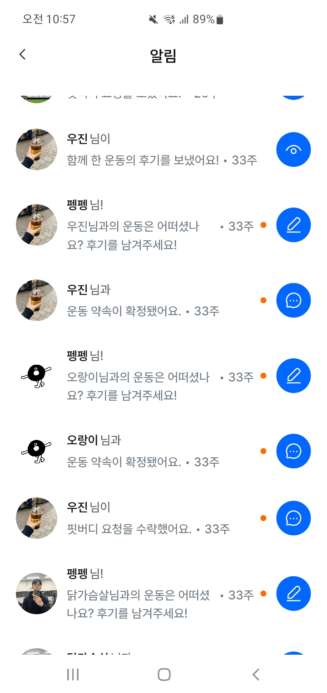
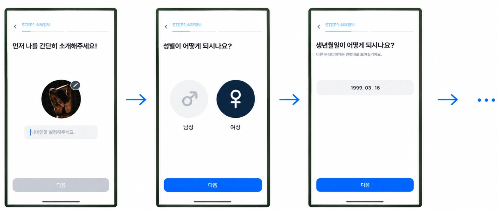
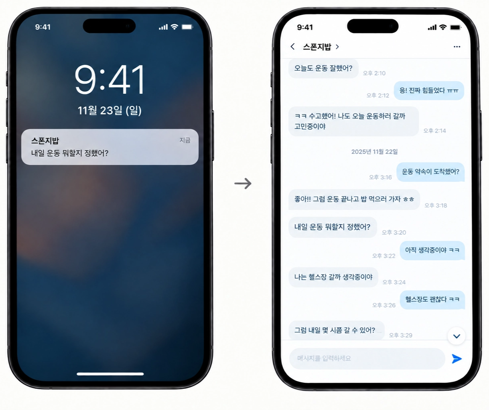
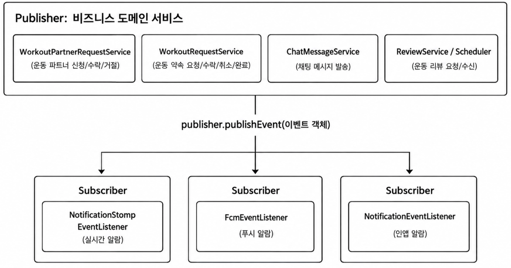
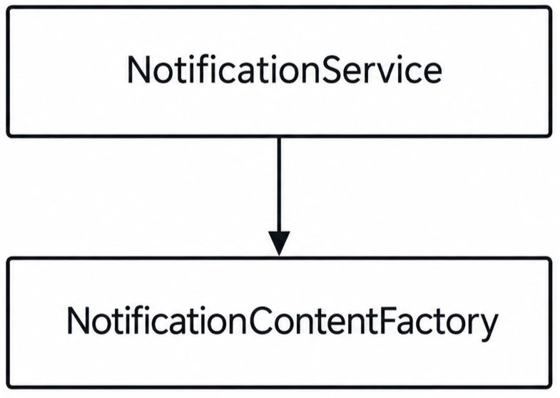
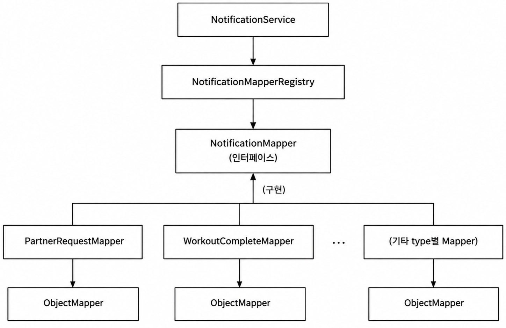

# 설계 고민과 의사결정 기록

### ※ 전부 공개 허락을 받는 내용입니다

### 목차

- [1. ERD 설계](#1-erd-설계)
    - [1.1 기획자의 의도와 다르게한 설계](#11-기획자의-의도와-다르게한-설계)
    - [1.2 알림 내용을 json 필드로 설계한 이유](#12-알림-내용을-json-필드로-설계한-이유)
    - [1.3 이미지 도메인을 중간 테이블로 분리해 설계한 이유](#13-이미지-도메인을-중간-테이블로-분리해-설계한-이유)
    - [1.4 회원 고유성을 가상 컬럼으로 지킨 이유](#14-회원-고유성을-가상-컬럼으로-지킨-이유)
- [2. 코드 설계](#2-코드-설계)
    - [2.1 닉네임 고유성을 캐시 예약으로 지킨 이유](#21-닉네임-고유성을-캐시-예약으로-지킨-이유)
    - [2.2 채팅 메시지의 조회 성능, 양방향 스크롤 문제](#22-채팅-메시지의-조회-성능-양방향-스크롤-문제)
    - [2.3 비즈니스 로직과 알람 도메인의 강결합 문제](#23-비즈니스-로직과-알람-도메인의-강결합-문제)
    - [2.4 알람 JSON 필드 역직렬화 문제](#24-알람-json-필드-역직렬화-문제)
    - [2.5 순환 의존성 문제](#25-순환-의존성-문제)

# 1. ERD 설계

- 전체 내용

사진을 확대하면 전체 내용을 볼 수 있습니다

(오른쪽 클릭 → 새 탭에서 이미지 열기)


### 1.1 기획자의 의도와 다르게한 설계



- 설명
    - 기획자분은 회원 간의 “운동 신청” 기능을 원함
    - “운동 신청”은 실패, 진행, 완료 상태를 가질 수 있음
    - 이때, 본인은 “운동 신청” 뿐만 아니라 “운동 이력” 도메인을 만들었음
    - “운동 이력” 도메인은 운동 신청이 완료된 건만 별도로 보관
- 고민한 부분
    - 운동 신청 완료된 건이 앱에서 비즈니스적으로 중요한 지표임
        - 즉, 기획자분이 완료 데이터를 중요하게 보고 있음
        - 어드민에서 운동 완료 건을 수집하고 있고, 추후에도 운동 완료 데이터를 활용할 것 같음
    - 운동 신청이 완료 상태면 서로 후기를 쓸 수 있음
    - A 회원이 B 회원에게 운동 신청을 이미 했는지 조회 필요
        - 중복 운동 신청이 불가하기 때문에, A ↔ B 회원 간의 운동 신청 여부 조회가 필요
    - 1명의 사용자가 어떤 사람들에게 운동 신청을 했는지 추적 필요
- 고려한 방법
    1. 운동 신청 테이블 하나 + 상태 필드로 표현
        - 장점
            - 기획 의도와 일치하기 때문에, 기획자와 협업할 때 충돌하는게 없음
            - 테이블 구조가 단순함
        - 단점
            - 쿼리 성능 문제
                - 신청 방향(A→B) 유지로 인해, 두 사용자 간 이력 조회 시 OR 쿼리 필요
            - 데이터 활용의 한계
                - 한 테이블에 모든 상태(진행/실패/완료)가 혼합되어, 완료 데이터가 어드민 지표, 리뷰 등의 기준점이 되기 애매함
    2. 운동 이력 도메인 분리
        - 운동 신청 테이블에서 완료된 데이터 건은 운동 이력 테이블에 다시 저장
        - 장점
            - 쿼리 최적화
                - 운동 완료 건만 수집 시, 별도 WHERE 필요 없이 운동 이력만 조회하면 됨
                - 이에 따라, 쿼리가 단순해지며 조회 성능 최적화
            - 비즈니스 로직 단순화
                - 후기, 어드민 지표에서 운동 완료 건만 필요한 경우가 있음
                - 운동 신청 도메인만 있다면 운동 신청 도메인에서 완료 건만 걸러내야함
                - 운동 이력 도메인이 있으면 별도 조건없이 운동 이력 조회해서 후기, 어드민 지표에 전달하기만 하면 되니 로직이 단순화됨
        - 단점
            - 운동 신청 상태 + 운동 이력의 중복 관리 필요
            - 기획 의도와 충돌되니, 이후에 제작될 기획자 설계와 충돌할 수 있음
- 결론
    - 2번 방법(운동 이력 도메인 분리)을 택함
    - 이득
        - 운동 완료 건만 별도로 필요한 케이스에서 쿼리 및 비즈니스 로직이 간편화됨
        - 추후 기능 도입에서 기능 제작이 간편화됨
            - 운동 완료에 대한 리워드 보상 이벤트가 있었음
            - 이때, 운동 이력 도메인이 별도로 있었기 때문에 기능 제작이 더 간편했음
    - 손해
        - 기획자와의 소통 문제
            
            
            
            - 기획자분은 어드민에서 후기 조회 시, 운동 신청 id를 원함
            - 본인 설계에서는 후기 조회 시, 운동 이력 id가 조회되는게 맞음
            - ⇒ 기획자, 개발자 간의 설계 충돌
        - 보완
            - 운동 이력은 운동 신청 id를 갖도록 설계
            - ⇒ 운동 이력은 운동 신청 id를 가지기 때문에, 운동 신청 id를 요구하더라도 요구사항 반영됨
- 회고 - 돌아본 판단
    - MySQL의 Generated Column(STORED) 기능 도입이 더 적합했을 것이라 판단됨.
    - 방법
        - 운동 이력 도메인 사용X
        - 운동 신청 도메인에서 별도 STORED 필드로 회원1, 회원2 id를 오름차순 or 내림차순으로 기록하는 방식
    - 이유
        - 조회 성능 최적화 (OR 쿼리 병목 해결)
            
            
            | id | from_member_id | to_member_id | **sorted_id1** | **sorted_id2** |
            | --- | --- | --- | --- | --- |
            | 1 | 10 | 20 | **10** | **20** |
            | 2 | 20 | 10 | **10** | **20** |
            | 3 | 30 | 10 | **10** | **30** |
            - 상황 : A ↔ B 회원 간의 운동 신청이 있었는지 확인하고, 없으면 A → B 운동 신청 허가
            - 기존 문제) 운동 신청 방향성 때문에 A, B 간 이력 조회 시 OR 쿼리가 강제되어 쿼리 실행 계획이 불안정함
            - 해결) 오름차순된 파생컬럼(stored_id)으로 OR 쿼리 사용 없이 두 사용자 간 이력 조회 가능
        - 데이터 정합성 보장
            - 운동 신청 테이블 하나로 관리되어, 기존의 신청, 이력 도메인 간 동기화 문제 없음
        - 기획 의도와 맞음
            - 기존 방법은 새로운 도메인을 만들었기 때문에 이후 기능 설계에서 부딪히는 경우가 있었음
            - 해당 방법은 기획 도메인을 넘어서지 않았기 때문에 기획과 부딪히는 부분이 없음
    - 결론
        - MySQL의 Generated Column(STORED)을 도입하는 편이 더 적합했을 것이라고 판단함
        - STORED 필드는 MySQL에 종속되지만, MVP 단계에서 DB 이식성까지 고려하는 것은 과하다고 생각됨
        - 기획 도메인을 유지하면서 회원 쌍 조회 쿼리를 단순화할 수 있어, 이 상황에서는 더 적절한 선택이었을 것으로 판단

### 1.2 알림 내용을 json 필드로 설계한 이유

- 테이블


- 화면
    
    
    
- json 필드(content) 예시

```java
// 운동 요청
{
  "payload": {
		 // 알림 클릭 시, 다음 페이지 이동을 위한 정보들
    "chatRoomId": 1,
    "chatMessageId": 3,
    "workoutRequestId": 1
  }
}
```

- 설명
    - 사용자 간의 특정 상호작용(친구 요청 등)은 인앱 알림을 만듦
    - 인앱 알림은 notification 테이블에 저장
    - 인앱 알림의 구체적 내용은 content 필드에 json 형태로 저장
- 요구사항
    - 인앱 알림 유형은 9개이며, 앞으로 더 많아질 수 있음
    - 인앱 알람을 눌렀을 때, 다른 페이지(상대방 프로필 등)로 이동 필요
    - 인앱 알람을 발생시킨 상대방 프로필이 나타나야 함
- 고려한 방법
    1. 알림 상세 내용을 여러 FK 필드로 관리
        - 방법
            - Notification 테이블에 알림과 관련한 대상(상대방 회원, 리뷰, 운동)들을 각각 FK 컬럼으로 관리
        - 장점
            - 테이블의 필드 내용이 명확해짐
            - DB 레벨에서 (알람 - 다른 도메인) 사이의 참조 무결성 보장
        - 단점
            - 알림의 유형이 많아질수록 FK 필드 증가
            - 또한, FK 필드의 NULL이 많아지면서 관리가 어려워짐
    2. 알림 상세 내용은 json 필드로 관리
        - 방법
            - json 필드 1개로 다른 도메인 간의 정보 등등을 모두 담음
        - 장점
            - 알람 유형이 수정되더라도 테이블 구조를 안바꿔도됨
        - 단점
            - json 필드 구조에 대한 문서 관리 필요
            - 서버에서 json 파싱에 따른 관리 비용 증가
            - FK 참조 무결성 포기
- 결론
    - 알림 상세 내용은 json 필드로 관리
    - 이유
        - 알림은 도메인이 추가될 때마다 요구가 바뀔 가능성이 높아, FK 방식이라면 테이블 컬럼 변동이 잦을 것으로 예상함
        - 운영 중 테이블 구조 변경은 마이그레이션 부담과 사이드 이펙트 위험이 큼
        - 반면 서버 로직은 테스트 코드와 모니터링으로 오류를 발견하고 대응하기 쉬움
        - 따라서 서버의 복잡성이 늘어나는 비용을 감수하고, DB 구조 변경을 최소화하는 쪽을 선택함

### 1.3 이미지 도메인을 중간 테이블로 분리해 설계한 이유


- 설명
    - Image 테이블
        - 이미지 URL 정보만 담음
    - 중간 테이블
        - 각 도메인에 이미지 필요 시, 중간 테이블로 관리
        - ex)
            - 회원은 프로필, 운동 사진등을 보유
            - Member - MemberImage - Image로 설계
- 고려한 방법
    1. 각 도메인 테이블에 이미지 컬럼을 두는 방식
        - 방법
            - 이미지가 필요한 도메인 테이블에 이미지 컬럼을 직접 추가
        - 장점
            - 구조가 단순하고 별도 조인이 필요 없음
        - 단점
            - 이미지는 프로필, 신고 사진 등 여러 곳에서 쓰일 수 있음. 따라서, 1개에서 여러 개로 필드가 늘어날 가능성이 큼
            - 도메인마다 이미지 컬럼이 쌓여 프로젝트가 확장될수록 도메인 테이블이 지저분해짐
    2. Image가 도메인 FK를 직접 가지는 방식
        - 방법
            - Image 테이블에 `member_id` 같은 FK 컬럼을 두고 도메인과 직접 연결
        - 장점
            - 중간 테이블이 없어 테이블 수가 적고 구조가 단순함
        - 단점
            - 1:1 연결이면 이미지를 1개로 강제하게 됨. 운동 사진이나 운동일지처럼 여러 장이 필요한 경우가 많아 확장성이 떨어짐
            - 도메인이 늘수록 Image 테이블에 FK 컬럼이 계속 추가됨
                - 대부분의 컬럼이 NULL이 되고, 소속 도메인을 판별하려면 여러 FK를 확인해야 함
                - FK 컬럼마다 인덱스가 필요해 관리 부담이 커짐
                - 이미지별 type을 어떻게 관리할지 고민이 커짐
    3. Image와 도메인 사이에 중간 테이블을 두는 방식
        - 방법
            - Image는 URL 등 이미지 자체 정보만 담고, 도메인별 중간 테이블(예: Member - MemberImage - Image)로 연결
        - 장점
            - 도메인이 늘어도 Image 테이블은 변경할 필요가 없음
            - 이미지를 여러 장 연결하는 구조로 자연스럽게 확장 가능
            - `seq`, `type` 같은 관계별 속성을 중간 테이블에서 관리 가능
            - Image 테이블에 FK 컬럼과 인덱스가 늘어나지 않음
        - 단점
            - 이미지를 쓰는 도메인마다 중간 테이블이 늘어남
            - 조회 시 조인이 한 번 더 필요함
- 결론
    - 결정
        - 중간 테이블 방식 채택
    - 이유
        - 이미지는 여러 도메인에서 여러 장 사용될 가능성이 크다고 봤음. 그래서 초기부터 확장 가능한 구조가 필요하다고 생각
        - 중간 테이블이 늘어나는 단점은 모두 동일한 패턴이라 관리 비용을 예측할 수 있다고 판단해 감수하기로 함
        - 그 대가로 Image 테이블의 독립성, type/seq 관리, 확장성을 확보함

### 1.4 회원 고유성을 가상 컬럼으로 지킨 이유


- 상황
    - MySQL 사용
    - 회원가입은 소셜 로그인만 존재
        - platform : 플랫폼 종류 ex) GOOGLE, KAKAO
        - platform_id : 해당 플랫폼에서 발급한 고유 ID
    - 회원 탈퇴 시 정보 유지를 위해 soft delete 정책 사용 (deleted_at 필드 활용)
- 문제 상황
    - UNIQUE(platform, platform_id) 제약으로 회원 고유성 보장 가능
    - 하지만 soft delete 특성상 하나의 플랫폼 계정으로 탈퇴 후 동일 계정으로 재가입 시도 시, UNIQUE 제약에 걸려 재가입 불가능한 문제 발생
- 고려한 방법
    
    1. 가상 컬럼 활용
    
    - 방법
        - deleted_at 이 NULL일 때만 값을 갖는 가상 컬럼을 만들고, 해당 컬럼에 UNIQUE 제약 설정
    - 장점
        - 단일 DB(MySQL) 운영 중이라 스키마 설정만 추가하면 되어 작업 비용이 낮음
        - platform, platform_id 등 기존 필드 훼손X
    - 단점
        - 가상 컬럼은 모든 DB에서 지원하는 기능이 아니라 MySQL 의존적인 정책이 됨
    
    2. UNIQUE 컬럼에 삭제 시간을 포함해 유니크 지키기
    
    - 방법
        - platform_id 값 자체에 삭제 시점 정보를 포함시켜 UNIQUE 충돌 회피
    - 장점
        - 특정 DB 문법에 의존하지 않는 정책
    - 단점
        - platform_id 원본 값이 훼손되어, 이후 특정 회원 조회나 이력 추적 시 조회 로직이 복잡해짐
    
    3. 서버 레벨에서 검증
    
    - 방법
        - 서버에서 platform, platform_id, deleted_at에 락을 걸어 조회 후 문제 없으면 삽입
    - 단점
        - 데이터 INSERT에 대한 동시성 문제 해결도 필요하기 때문에 구현이 복잡해짐
        - (platform, platform_id, deleted_at) 조합을 건드리는 모든 로직(신규 가입 API, 탈퇴 취소 기능 등)에서 매번 이 락 정책을 빠뜨리지 않고 적용해야 하므로 유지보수 부담이 커짐
        - 반면 DB 레벨 UNIQUE 제약(1, 2번)은 어떤 경로로 데이터가 들어오든 DB 엔진이 강제로 무결성을 보장한다는 점에서 더 안전하다고 판단해 채택하지 않음
- 결론
    - 결정
        - 가상 컬럼 방식 채택
    - 이유
        - 프로젝트 초기 단계로 아직 시장 검증이 되지 않은 상태이며, 트래픽 규모나 기능 요구사항 면에서 MySQL의 한계에 부딪힐 가능성이 낮음
        - 이런 상황에서 DB 이식성까지 고려해 설계를 복잡하게 가져가는 것은 오버 엔지니어링이라고 봄
        - 빠르게 제작해 시장 검증을 받는 것이 우선순위인 프로젝트 특성상, 당장 필요하지도 않은 이식성을 위해 원본 데이터 훼손과 조회 복잡성이라는 비용을 감수할 이유는 없다고 결론지음

# 2. 코드 설계

### 2.1 닉네임 고유성을 캐시 예약으로 지킨 이유

- 상황
    - 현재 상태
        - 앱은 이미 운영 중
        - 회원가입 시 닉네임 입력이 가능하고, 닉네임이 겹쳐도 됨
    - 요구사항
        
        
        
        - 기획에서 닉네임을 **고유**하게 바꾸고 싶어 함
            - 이유: 회원을 닉네임으로 검색했을 때, 해당 회원만 검색되도록 하기 위함
        - 닉네임이 겹치면 “중복 닉네임”임을 텍스트로 표시하고 닉네임 등록 불가
    - 제약 조건
        - 기획에서는 기존 화면 변경이 최소화 되기를 원함
            - 기획, 디자인에서 다음 기능 작업 중이기 때문에 변경 요청이 최소화 되길 원함
- 문제 상황
    - 회원가입 화면 흐름 (사용자 관점)
        
        
        
        - 프로필, 닉네임 등록 페이지→ 생년월일 등록 페이지 → … → 자기소개 페이지
        - 사용자는 닉네임 페이지를 넘어가면 "내 닉네임은 사용 가능하다"고 인식
    - 회원가입 API 흐름 (서버 관점)
        - 모든 회원가입 정보를 마지막에 한 번에 모아서 서버로 보냄
    - 문제 발생 → 닉네임 입력, 회원가입 사이에 갭
        - 사용자는 닉네임이 된다고 생각했는데 중복 닉네임으로 회원가입 실패될 수 있음
        - 예시
            - A 회원 : 닉네임 "홍길동" 입력 (사용 가능 확인) → 생년월일 … 자기소개 진행 중
            - B 회원 : 같은 시간에 "홍길동"으로 회원가입 완료
            - A 회원 :  회원가입 API 호출 → **실패**
- 고려한 방법
    1. 닉네임 페이지를 마지막 페이지로 옮기기
        - 방법
            - 회원가입 절차의 맨 마지막 페이지로 닉네임 페이지를 넣음
        - 장점
            - 닉네임 입력 시점과 가입 API 호출 시점이 일치해서, 서버 구현이 가장 쉬움
                - 회원가입 API에서 중복 닉네임 에러만 내려주면 작업 끝
            - 실패해도 같은 페이지에서 사용자가 닉네임 중복 에러를 보고 수정할 수 있음
        - 단점
            - FE와 디자인 모두 작업이 필요함
                - FE: 페이지 순서 변경
                - 디자인: 피그마 플로우 수정
            - 플로우가 적절한지 논의 필요
                - 기획, 디자인과 논의하여 닉네임 페이지를 마지막에 넣는게 타당한 지 따져야함
        - 판단
            - ⇒ 선택X
            - 화면 변경 요청을 최소화하길 원하셔서, 서버에서 더 작업하는 방법을 고려함
    2. DB에 닉네임만 등록하기
        - 방법
            - 닉네임 페이지를 넘어갈 때, 해당 닉네임만 DB에 등록
        - 장점
            - 회원가입을 마치는 시점에 닉네임 중복 문제가 없음
        - 단점
            - 닉네임만 등록하고 가입하지 않는 케이스가 생김
                - 가입도 안 했는데 닉네임만 존재해서 데이터가 더러워짐
                - 가입하지 않은 유령 회원의 닉네임인데, 다른 사람이 그 닉네임을 쓰지 못함
        - 판단
            - ⇒ 선택X
            - 유령 회원의 닉네임 점유가 문제될 여지가 커보임
    3. 사전 중복 체크 + 최종 가입 시 재검증
        - 방법
            - 닉네임 페이지에서 닉네임 체크 API로 사용 가능 여부를 확인
            - 회원가입 API에서 한 번 더 검증
            - 회원가입 API에서 닉네임 중복이면 닉네임 페이지로 다시 이동
        - 장점
            - 기획에서 원하는 플로우를 그대로 유지할 수 있어, 변경 최소화 조건에 가장 잘 맞음
            - 구버전 앱과 호환 가능
                - 구버전 앱 : 회원가입 에러면 “회원가입 실패” 메시지와 함께 회원가입 종료
                - ⇒ 회원가입 API에서 중복 닉네임 에러를 추가해도 구버전과 호환됨
        - 단점
            - 닉네임 입력, 회원가입 사이에 갭 문제가 해결 안됨
                - 닉네임 페이지 이후에, 중복 닉네임으로 회원가입 실패가 될 수 있음
                - 해당 케이스의 회원은 이탈 가능성이 높아 보임
        - 판단
            - ⇒ 선택X
            - 사용자 경험을 최우선으로 보기 때문에 단점을 그대로 두기 어려움
    4. 캐시로 닉네임 예약
        - 방법
            - 사용자가 닉네임 페이지를 넘어가면, 해당 닉네임을 캐시에 저장
            - 일정 시간(ex - 30분) 동안은 해당 회원만 그 닉네임을 선점할 수 있음
            - 해당 시간이 지나면 다른 회원이 사용할 수 있음
        - 장점
            - 3번의 장점 유지
            - 3번의 단점이었던 "회원가입 API 호출 시점의 닉네임 중복"이 발생할 가능성을 최소화
        - 단점
            - 예약과 관련한 서버 로직 필요
            - FE와 어떤 API 흐름으로 예약을 다룰지 설계가 필요
            - 가입을 이탈한 사용자의 예약 시간동안 닉네임을 묶고 있음
- 결론
    - 결정
        - 캐시로 닉네임 예약을 선택
    - 이유
        - 기획·디자인의 화면 변경 요청을 최소화하면서, 가입 중 닉네임 중복 실패 가능성을 줄일 수 있는 방법이므로 선택
    - 감수한 트레이드오프
        - 서버에 예약 로직이 추가됨
        - 회원가입 중 이탈한 사용자의 예약 시간동안 해당 닉네임 사용 불가
- 보완
    - 닉네임 예약이 실패하는 경우 대비
        - 최종 방어선으로 DB에 닉네임 UNIQUE 제약을 둠
        - 회원가입 시 닉네임 중복이 생기면 닉네임 중복 에러를 내려줌
    - FE에서 API 호출 최소화
        - 닉네임 고유 여부 확인 + 닉네임 예약을 1개 API로 합침
            - 예약이 안 되면 쓸 수 없는 닉네임, 예약이 되면 쓸 수 있는 닉네임으로 판정
            - 같은 사용자가 닉네임을 여러 번 예약하면, 기존 예약은 지우고 가장 최근 1개만 유지
        - ex)
        
        ```json
        POST /api/v1/members/nicknames/reserve
        
        "data" : {
          "isReserved" : true
        }
        ```
        
        <aside>
        
        - `isReserved: true` 케이스
            - 닉네임을 예약함
            - 같은 회원이 같은 닉네임을 이미 예약한 경우, 예약 시간을 처음으로 되돌림
            - 같은 회원이 다른 닉네임을 이미 예약한 경우, 기존 예약을 취소하고 새 닉네임을 예약함
        - `isReserved: false` 케이스
            - 이미 가입한 회원이 해당 닉네임을 사용 중인 경우
            - 다른 회원이 해당 닉네임을 예약 중인 경우
            - 이미 가입한 회원이 닉네임을 예약하는 경우
        </aside>
        

### 2.2 채팅 메시지의 조회 성능, 양방향 스크롤 문제


- 요구사항
    - 채팅 메시지 조회 방법
        - 일반 진입
            - 최신 메시지부터 조회
            - 위로 스크롤하며 과거 메시지 조회
        - 특정 메시지 위치로 진입
            - ex) 푸시 알람 누름 → 해당 채팅 메시지로 이동
            
            
            
    - Q) 왜 커서 기반으로 했을까?
        - 과거일수록 id가 더 작다라는 가정이 맞지 않을 수 있음
        - ex) 데이터 마이그레이션, 메시지가 잘못돼서 메시지를 DB에서 없애고 새로 추가하면 최근 id인데, 메시지 시간은 과거인 것 등
- 고려한 방법
    1. Offset 기반 페이징
    - 방식
        - `LIMIT n OFFSET m` + 전체 건수 `count` 쿼리
    - 장점
        - 구현이 쉽고, 페이지 번호로 이동 가능
    - 단점
        - 뒤쪽 페이지일수록 스캔 범위 증가
        - 실시간 삽입 시 페이지가 밀려 중복·누락 발생
        - `count` 쿼리 비용
    - 판단
        - ⇒ 부적합
        - 채팅은 페이지 번호가 필요 없음
        - 실시간 메시지 추가가 가능하므로 중복, 누락 문제 발생이 쉬움
    1. Offset 기반 Slice
    - 방식
        - Offset 유지 + `count` 제거 (`size+1` 조회로 `hasNext` 판단)
    - 장점
        - `count` 비용 제거
    - 단점
        - 스캔 증가, 중복·누락 문제는 그대로. `hasNext`만 있어 반대 방향 정보 없음
    - 판단
        - ⇒ 부적합
        - 핵심 문제(성능 저하, 중복/누락 조회, 양방향)를 해결하지 못함
    1. 양방향 Offset
    - 방식
        - 위/아래 방향 각각 offset을 계산해서 조회
    - 장점
        - 양방향 조회 문제 해결
    - 단점
        - 중복 데이터 조회 문제
            - 문자가 실시간 INSERT 되므로, 이전 이력 문자 조회 시 중복 조회될 수 있음
            - ex) 최근 메시지 조회 + 오프셋으로 이전 메시지 조회 상황에서 발생
        - offset의 스캔 범위 증가 문제 해결 안됨
    - 판단
        - ⇒ 부적합
        - 핵심 문제(중복 데이터 조회)를 해결하지 못함
    1. ID 기반 양방향 커서
    - 방식
        - 위치를 `id` 값으로 표현하는 커서 방식
        - 기준 메시지 `id`와 방향(`direction`)을 받아 해당 방향으로 `size`건 조회한다.
        - hasNext, hasBefore 데이터를 추가하여 과거/최근 조회
            - hasNext = true
                - 현재 메시지보다 최근 문자 존재
            - hasBefore = true
                - 현재 메시지보다 과거 문자 존재
            - ⇒ FE는 hasNext, hasBefore를 활용해서 과거, 최근 문자 조회 요청 보냄
    - 장점
        - 치명적 문제(중복 데이터 조회, 성능 저하 등)를 모두 해결
        - 요구 사항 모두 만족
    - 단점
        - 메시지 id가 클수록 최신 메시지라는 전제가 항상 성립되어야함
    - 판단
        - ⇒ 선택X
        - “메시지 id가 클수록 최신 메시지다” 라는 것이 보장되지 않음
        - ex)
            - 데이터 마이그레이션, 잘못 만들어진 메시지 삭제 후 재등록
            - ⇒ 이런 상황들은 id 값 재갱신으로 위 전제를 무너뜨릴 수 있음. 따라서, 선택X
    1. 시각(`sent_at`) 기반 양방향 커서
    - 방식
        - 위치를 `sent_at` 값으로 표현하는 커서 방식
        - 기준 시각(`lastMessageAt`)과 방향(`direction`)을 받아 해당 방향으로 `size`건 조회한다.
        - `hasNext`, `hasBefore` 데이터를 추가하여 과거/최근 조회
            - (ID 기반 양방향 커서와 마찬가지로 hasNext, hasBefore을 명시하여 FE에서 이전, 최근 데이터가 있는지 알 수 있도록 함)
        - 커서는 `LocalDateTime`이 아닌 epoch millis(Long)로 주고받아 포맷 문제를 피함
            - ex)
            
            ```sql
            // X
            GET /messages?lastMessageAt=2026-10-07T11:46:41
            
            // O
            GET /messages?lastMessageAt=1789999900456
            ```
            
    - 장점
        - 치명적 문제(중복 데이터 조회, 성능 저하 등)를 모두 해결
        - 메시지 id 순서와 시간 순서가 어긋나도 순서 오류가 없음
    - 단점
        - 요구 사항(특정 메시지 위치로 진입) 만족이 어려움
            - 특정 메시지 1개를 정확히 지정할 수 있어야함
            - sent_at은 고유값이 아니기 때문에 보장이 안됨
    - 판단
        - ⇒ 선택X
        - 단점에 따라 요구 사항 만족이 안되므로 선택X
    1. ID + 시각(sent_at) 기반 양방향 커서
    - 방식
        - `targetChatMessageId`(id)와 `lastMessageAt`(sent_at, epoch millis)을 모두 선택 파라미터로 받아 where 조건에 사용
        - 두 값을 함께 보내면 AND로 결합, 둘 다 만족하는 메시지만 `direction` 방향으로 조회
        - hasNext, hasBefore 데이터를 보내어 FE에서 과거, 최신 데이터가 있는지 판단 가능
    - 장점
        - id 기반, sent_at 기반 양방향 커서의 단점들 해결
        - 그 외 요구사항 모두 만족
    - 단점
        - API 복잡성 문제
            - id, sent_at 2개를 기준으로 하니 FE, BE 둘 다 이해가 어려움
    - 판단
        - ⇒ 선택O
        - 다른 방법들의 단점들은 수용하기 어렵다고 판단되어, 해당 방법들 택함
- 결론
    - 선택
        - ID + 시각(sent_at) 기반 양방향 커서
    - 선택 이유
        - 두 값의 역할을 분리해 각 방식의 단점을 상쇄
        - ID → 특정 메시지 지정 (sent_at은 유일하지 않아 불가능했던 부분)
        - sent_at → 시간 순서 기준 (id 대소 관계가 시간 순서와 어긋날 수 있어 불가능했던 부분)
    - 트레이드오프: API 복잡도 증가
        - 기준이 2개가 되면서 FE, BE 모두 이해 비용 발생
    - 단점 보완
        - API 복잡성 완화 장치
            - 모든 파라미터를 Optional로 두고 기본값 제공
                - `size` 기본 10, `direction` 기본 DESC
                - 일반 진입은 기준 값 없이 호출해도 최신 메시지부터 조회
            - 용도별로 단독 사용 가능
                - 시간(sent_at)만 사용 → 시간 기반 커서로 작동
                - id만 사용 → id 기반 커서로 작동
                - 둘 다 사용 → AND 조건으로 결합
            - FE의 시간 변환 연산 제거
                - 문제점
                    - 응답의 `sentAt`은 `2026-05-27T09:43:43.397326833` 같은 문자열 형태
                    - 다음 요청의 쿼리 파라미터`lastMessageAt`은 epoch millis 형태
                    - ⇒ FE가 `sentAt`을 epoch millis로 변환한 뒤 쿼리 파라미터에 넣어야 함
                - 해결
                    - `pagination`의 `firstCursorAt`, `lastCursorAt` 필드로 첫 번째, 마지막 원소의 epoch millis 시간을 반환
                    - FE는 변환 없이 바로 쿼리 파라미터로 사용 가능
    - 예시
        - 쿼리 파라미터
        
        | 파라미터 | 필수 | 기본값 | 설명 |
        | --- | --- | --- | --- |
        | `size` | X | 10 | 조회 크기 |
        | `direction` | X | DESC | ASC(과거→최신) / DESC(최신→과거) |
        | `lastMessageAt` | X | - | 기준 시각(epoch millis) |
        | `targetChatMessageId` | X | - | 기준 메시지 id |
        - 용도별 사용
        
        ```
        // 일반 진입: 파라미터 없이 호출, 최신 메시지부터 조회
        GET /api/v1/chats/456/messages
        
        // 시간 기반 커서: lastMessageAt만 사용
        GET /api/v1/chats/456/messages?lastMessageAt=1779875623000&direction=DESC
        
        // id 기반 커서: targetChatMessageId만 사용
        GET /api/v1/chats/456/messages?targetChatMessageId=2
        
        // 둘 다 사용: AND 조건으로 결합
        GET /api/v1/chats/456/messages?targetChatMessageId=2&lastMessageAt=1779875623000
        ```
        
        - 부가 정보
        
        ```json
        "content": [
          {
            "chatMessageId": 12,
            "sentAt": "2026-05-27T09:45:10.512348211",   // ← firstCursorAt (1779875110512)
            "content": "네 확인했습니다"
          },
          ...
          {
            "chatMessageId": 10,
            "sentAt": "2026-05-27T09:43:43.397326833",   // ← lastCursorAt (1779875023397)
            "content": "안녕하세요!"
          }
        ],
        "pagination": {
          "size": 10,
          "firstCursorAt": 1779875110512,   // content 첫 원소의 sentAt → epoch millis
          "lastCursorAt": 1779875023397,    // content 마지막 원소의 sentAt → epoch millis
          "hasNext": true,
          "hasBefore": true
        }
        ```
        
- 회고
    - 아쉬운 점: ID 기반 양방향 커서로 했어도 충분해 보임
        - id 기반을 탈락시킨 근거가 운영에서는 발생하지 않음
            - "재insert로 id 순서가 시간 순서와 뒤바뀐다"는 상황이 운영하면서 한 번도 없었음
        - ID + 시각 방식의 장점을 실제로는 살리지 못함
            - 기대했던 장점
                - id 기반의 단점(id 대소와 시간 순서가 어긋날 수 있음)을 sent_at이 보완
                - sent_at 기반의 단점(유일하지 않아 특정 메시지를 지정 못 함)을 id가 보완
                - ⇒ 두 값을 쿼리 파라미터로 함께 써야 둘의 단점이 서로 상쇄됨
            - 실제로는 발휘되지 못함
                - 장점이 나오려면 FE가 `lastMessageAt`, `targetChatMessageId`를 항상 함께 보내야 함
                - 그런데 두 값을 매번 같이 쓰기엔 FE 입장에서 복잡함
                - 결과적으로 시간 기반 또는 id 기반 중 하나만 쓰게 됨
                - ⇒ 단독으로 쓰면 각 방식의 단점이 그대로 남아, 상쇄 효과가 발휘되지 않음
            - ⇒ 기준이 2개인 API의 복잡성은 그대로 감수하면서, 얻은 이점은 거의 없음
    - 결론: id 기반이 더 나은 선택이었다고 생각
        - 위치 지정이 단순하고 FE도 쓰기 쉬움
        - 운영에서 문제가 되지 않았으므로 단점도 현실화되지 않음
        - id 기반으로 시작하고, 문제가 생기면 그때 새 API를 만드는 방식이 좋았을 것 같음
    - 배운 점
        - 설계 장점은 사용하는 쪽(FE)이 실제로 그렇게 쓸때만 의미가 있음
        - 내가 복잡하게 설계하면, 쓰는 쪽도 복잡해짐

### 2.3 비즈니스 로직과 알람 도메인의 강결합 문제

- 요구사항
    - 알람은 3가지 종류가 존재
        - 인앱 알람, 푸시 알람, 실시간 알람
    - 각 도메인(운동 파트너, 운동, 채팅 등) 이벤트에 따라 알람이 발생
- 고려가 필요한 부분
    - 도메인마다 알람 호출을 위해서 제각기 다른 데이터를 넘겨줘야함
        - ex) 운동 파트너 요청 알람 → 요청자, 수신자, 요청 ID 등의 데이터 필요
        - ex) 채팅 알람 → 채팅방 ID, 발신자, 메시지 내용 등의 데이터 필요
- 문제점
    - 각 도메인의 비즈니스 로직은 알람을 알아야함
        - ⇒ 알람이 필요한 도메인마다 모두 알람 로직을 넣어야됨
    - ex) 운동 파트너 요청 로직은 각 알람을 모두 알고 있음
    
    ```java
    @Service
    @Transactional
    class WorkoutPartnerRequestService(
        private val workoutPartnerRequestRepository: WorkoutPartnerRequestRepository,
        private val notificationService: NotificationService,       // 인앱 알람
        private val fcmTokenService: FcmTokenService,               // 푸시 알람
        private val stompPublishService: StompPublishService,       // 실시간 알람
    ) {
    
        fun addWorkoutPartnerRequest(/* ... */) {
            // 도메인 로직
            workoutPartnerRequestRepository.save(/* ... */)
    
            // 알람 로직 호출
            stompPublishService.sendWorkoutPartnerRequest(/* ... */)
            fcmTokenService.sendWorkoutPartnerRequest(/* ... */)
            notificationService.saveWorkoutPartnerRequest(/* ... */)
        }
    }
    ```
    
- 고민한 방법
    1. Facade 패턴
        - 방법
            - 알람 3종 호출을 NotificationFacade 하나로 묶고, 서비스는 Facade만 호출
            
            ```java
            @Component
            class NotificationFacade(
                private val notificationService: NotificationService,// 인앱 알람
                private val fcmTokenService: FcmTokenService,        // 푸시 알람
                private val stompPublishService: StompPublishService,// 실시간 알람
            ) {
            
                fun workoutPartnerRequested(/* ... */) {
                    stompPublishService.sendWorkoutPartnerRequest(/* ... */)
                    fcmTokenService.sendWorkoutPartnerRequest(/* ... */)
                    notificationService.saveWorkoutPartnerRequest(/* ... */)
                }
            }
            ```
            
        - 장점
            - 구조가 단순하고 호출 흐름이 명시적임
            - 비즈니스 로직은 Facade 객체에만 의존하면 됨
        - 단점
            - 서비스가 여전히 알람 모듈(Facade)을 직접 알아야 함
    2. pub/sub 패턴
        - 방법
            
            
            
            - 비즈니스 로직은 ApplicationEventPublisher로 이벤트만 발행
            - 알람 3종은 각 리스너가 구독해서 처리
            
            ```java
            @Service
            @Transactional
            class WorkoutPartnerRequestService(
                private val publisher: ApplicationEventPublisher,
                private val workoutPartnerRequestRepository: WorkoutPartnerRequestRepository,
            ) {
            
                fun addWorkoutPartnerRequest(/* ... */) {
                    workoutPartnerRequestRepository.save(/* ... */)
            
                    // 비즈니스 로직은 이벤트만 발행
                    publisher.publishEvent(WorkoutPartnerRequestEvent(/* ... */))
                }
            }
            ```
            
        - 장점
            - 비즈니스 로직은 알람 서비스를 직접 의존하지 않음
                - ApplicationEventPublisher에만 의존
            - 알람 로직 수정 시 리스너만 수정하면 됨
        - 단점
            - 이벤트·리스너 클래스가 늘어남
            - 비즈니스 로직에서 이벤트 발행 코드는 여전히 필요함
            - 이벤트 발행과 처리 흐름이 코드상 한눈에 보이지 않아 추적이 어려움
- 결론
    - pub/sub 패턴 선택
        - 비즈니스 로직이 알람 서비스를 직접 알지 못하도록 분리할 수 있는 pub/sub 패턴을 선택
    - Facade 패턴을 선택하지 않은 이유
        - Facade를 쓰더라도 비즈니스 로직이 알람 모듈(Facade)을 직접 알아야함
    - 감수한 트레이드오프
        - 이벤트·리스너 클래스가 늘어남
        - 이벤트 발행과 처리 흐름이 코드상 한눈에 보이지 않아 추적이 다소 어려워짐
        - 이벤트 발행 코드는 비즈니스 로직에 여전히 남음
            - 알람 데이터가 도메인마다 달라서 이 부분까지 막기는 어려웠음
- 보완 - (pub/sub 패턴의 단점들에 어떻게 대응했는지)
    - 단점) 이벤트·리스너 클래스가 늘어남
        - 리스너
            - 알람 종류별(인앱, 푸시, 실시간) 3개만 객체를 생성하여 클래스 최소화
        - 이벤트
            - Map이나 다형성으로 여러 이벤트를 한 번에 담을 수 있는 이벤트 객체를 만드려 시도
            - 하지만 여러 이벤트가 한 클래스에 담기면서 이벤트별 데이터 구조 파악이 너무 어려워짐
            - 따라서, 객체 수가 늘어나는 것은 감수함
                - 이벤트별로 별도 객체를 만들어 필드 자체가 데이터 를 설명 가능한 구조를 선택
    - 단점) 이벤트 발행과 처리 흐름이 코드상 한눈에 보이지 않아 추적이 다소 어려워짐
        - 이벤트 클래스 네이밍을 명확하게 해서 흐름 추적이 용이하도록 함
        - ex)
            - 운동 파트너 요청 알람
            - 푸시 알람
                - EventFcmWorkoutPartnerRequest
            - 실시간 알람
                - (Depth는 이벤트 객체를 json으로 변환 필요 시, json의 depth를 표현)
                - StompEventWorkoutPartnerRequestDepth1
                - StompEventWorkoutPartnerRequestDepth2
                
                ```java
                {
                	//depth1
                  "memberId": 2,
                  "message": {
                		 //depth2
                    "workoutPartnerRequestId": 10,
                    "memberId": 1,
                    "profileImageUrl": "https://...",
                    "nickname": "홍길동"
                  }
                }
                ```
                
    - 단점) 이벤트 발행 코드는 비즈니스 로직에 여전히 남음
        - 이벤트 생성 코드를 private 메서드로 분리하여 가독성을 높임
        - 한계
            - 알람에 필요한 데이터는 비즈니스 로직 실행 중에 생성됨
            - 이에 따라, 이벤트를 발행하는 책임은 비즈니스 로직에 남음
        
        ```java
        @Transactional
        fun addWorkoutPartnerRequest(/* ... */) {
            // 비즈니스 로직
            // ..
            
            sendStompWorkoutPartnerRequest(saved)   // 실시간 알람
            sendFcmWorkoutPartnerRequest(/* ... */) // 푸시 알람
            sendNotificationWorkoutPartnerRequest(/* ... */) // 인앱 알람
        }
        
        // private 메서드: 이벤트 조립·발행은 여기로 분리
        private fun sendStompWorkoutPartnerRequest(request: WorkoutPartnerRequest) {
        
            // 프로필 조회, 이벤트 객체 조립 ...
            publisher.publishEvent(event)
        }
        ```
        

### 2.4 알람 JSON 필드 역직렬화 문제

- 상황
    
    
    
    - notification 테이블의 content 컬럼은 JSON 타입
    - notification 테이블을 이용해서 알람 조회 API를 만들어야함
- 문제
    - type에 따라 content의 JSON 구조가 제각각임
    - 알람 조회 API는 content 컬럼의 JSON을 그대로 내려주지 않음
        - API 응답에 알람 유형별 추가 정보를 덧붙여야함
        - ex) 딥링크(앱에서 알람 눌렀을 때 다른 페이지 이동)
    - 새로운 도메인이 추가되면 type도 계속 늘어날 것으로 예상됨
        - ⇒ 새로운 JSON 구조를 기존 코드 수정을 최소화하면서 수용할 수 있는 구조가 필요
- 고민한 방법
    1. 단일 Service 내에서 모든 작업(json 파싱, 최종 응답 구조 등) 처리
        - 장점
            - 파일 1개에서 전체 흐름이 다보임
            - 구조가 단순
        - 단점
            - 수정 이후에 문제 생기면 어디서 잘못된 건지 파악이 어려움
        - 예시
        
        ```java
        class NotificationService() {
        
          fun getNotifications(notifications: List<Notification>): List<NotificationResponse> =
              notifications.map { notification ->
                  // type별 content 필드 파싱
                  val content = when (notification.type) {
                      WORKOUT_PARTNER_REQUEST -> objectMapper.convertValue(notification.content, PartnerContent::class.java)
                      ...
                  }
                  // type별 딥링크 생성
                  val link = when (notification.type) {
                      WORKOUT_PARTNER_REQUEST -> NotificationLink(MEMBER_PROFILE, mapOf("memberId" to (content as PartnerContent).payload.memberId))
                      ...
                  }
                  // 조합해서 response
                  NotificationResponse(notification.id, notification.type!!, sender, link)
              }
        }
        ```
        
    2. Factory 패턴
        - 설명
            
            
            
            - Factory 객체 생성
                - ⇒ type 별 content 필드의 json을 객체로 반환하는 객체
            - Service 객체
                - Factory 객체로 content를 객체로 받음
                - content 객체 + 부가 정보를 조합해서 response 만들기
        - 장점
            - Factory 객체를 통해서 content를 받기 때문에 역할/책임 분리가 명확해짐
        - 단점
            - Service의 수정 비용 문제
                - Service는 notification의 type별로 딥링크를 덧붙여야함
                - ⇒ type 추가 시, Factory 뿐만 아니라 Service도 수정 대상이 됨
            - type 분기 중복
                - Factory → type 분기로 content 파싱
                - Service → type 분기로 딥링크 생성
                - ⇒ type 분기 중복 코드 발생
        - 예시
        
        ```java
        class NotificationService(
        	private val factory: NotificationContentFactory
        ) {
          fun getNotifications(notifications: List<Notification>): List<NotificationResponse> =
              notifications.map { notification ->
                  // factory 객체에서 content JSON 필드를 객체화
                  val content = factory.create(notification)
        
                  // type별 딥링크 생성
                  val link = when (notification.type) {
                      WORKOUT_PARTNER_REQUEST -> NotificationLink(MEMBER_PROFILE, mapOf("memberId" to (content as PartnerContent).payload.memberId))
                      ...
                  }
                  // 조합해서 response
                  NotificationResponse(notification.id, notification.type!!, sender, link)
              }
        }
        ```
        
    3. Strategy 패턴
        - 설명
            
            
            
            - Service
                - notification 객체만 던지면 response 받음
                - type 의존X
            - Registry
                - Mapper에게 response 객체 생성을 위임
            - Mapper 인터페이스
                - type별 변환 공통 클래스
            - Mapper 구현체
                - type별 content 파싱, 딥링크 생성, 문구 포맷팅을 전담
        - 장점
            - type 추가에 따른 Service 수정X
                - Service는 type을 몰라도되는 구조
                - type 추가 시 Mapper 클래스만 수정하면 되므로 Service 수정X
        - 단점
            - type마다 Mapper 클래스가 늘어남
            - Mapper마다 content 변환(convertValue) 호출 코드가 반복됨
- 결론
    - 방법 3(Strategy 패턴) 사용
    - 이유
        - type 추가에 따른 수정 범위를 최소화하기 위함
            - type 수정에 따라 content + 딥링크 + 문구 포맷팅 수정 비용이 있음
            - Service가 type을 알아야 하는 구조면, Factory와 Service를 모두 수정해야 함
            - 따라서, type 수정 책임을 한 곳에 몰아넣는 설계를 함
    - 감수한 손해
        - type마다 Mapper 클래스 파일이 늘어남
            - ⇒ Mapper마다 content 변환 코드가 반복됨
            - ⇒ Mapper마다 테스트 코드가 반복됨

### 2.5 순환 의존성 문제

- 문제점 - 도메인 간의 순환 참조
    - 요구사항
        
        
        
        - 회원 조회 API
            - 회원은 상대 회원의 프로필을 볼 수 있음
            - 상대 프로필 조회 시, 내가 상대방에게 찜(하트)을 했는지 확인 가능
        - 찜 요청 API
            - 찜(하트)을 누르면 상대방을 내 찜 목록에 넣음
    - 문제 발생 : 순환 참조 (MemberService ↔ FavoriteService)
        - MemberService → FavoriteService
            - 회원 프로필 조회 시, 찜 여부 확인 필요
        - FavoriteService → MemberService
            - 찜 요청 시, 상대 회원이 존재하는지 확인 필요
    - 타 도메인에서의 순환 참조 문제
        - 위 상황뿐만 아니라 다양한 도메인에서 순환 참조 발생
        - 예시
            - 회원 ↔ 채팅방
                - 회원 조회 시 참여 중인 채팅방 정보 필요 / 채팅방 생성·참여 시 회원 확인 필요
            - 회원 ↔ 운동 파트너 요청
                - 회원 조회 시 파트너 요청 여부 확인 필요 / 파트너 요청 시 상대 회원 확인 필요
            - 등등
- 고려한 방법
    1. Repository 직접 참조
        - 설명
            - 다른 도메인의 Service 대신 Repository를 직접 호출
            - ex)
                - MemberService → FavoriteRepository
                - FavoriteService → MemberRepository
        - 장점
            - 서비스 간 의존이 사라져 순환이 해소됨
            - 구현이 단순하고 변경량이 적음
        - 단점
            - 다른 도메인의 저장소를 직접 알게 되어 도메인 경계가 흐려짐
    2. Facade 패턴
        - 설명
            - 상위 조정 서비스가 Member, Favorite을 각각 호출해 결과를 조합
            - 두 서비스는 서로를 몰라도 됨
        - 장점
            - 도메인 서비스 간 의존이 한 방향으로 정리됨
            - 도메인 서비스가 자기 책임에만 집중할 수 있음
        - 단점
            - 순환이 생길때마다 Facade가 필요함
            - 호출 흐름이 한 단계 늘어 추적이 번거로움
    3. Repository에 책임 부담 - 조회 쿼리에서 타 도메인 호출
        - 설명
            - 프로필 조회 쿼리에서 찜 테이블을 조인해 찜 여부를 한 번에 조회
            - 서비스 호출 없이 쿼리 레벨에서 해결
        - 장점
            - 서비스 간 의존X
        - 단점
            - 유연성이 떨어짐
                - 1개의 기능에 맞춰서 다른 도메인을 쿼리로 호출해야 함
                - 이에 따라, 함수 재사용이 어려워짐
            - 쿼리가 복잡해짐
    4. 순환 참조가 발생하는 도메인만 별도 객체 분리
        - 설명
            - 순환을 만드는 로직만 별도 클래스로 분리
            - ex) 찜 여부 확인 로직을 별도 객체로 빼서 Member, Favorite이 함께 사용
        - 장점
            - 문제가 되는 부분만 최소한으로 변경
            - 다른 도메인 구조에는 영향이 적음
        - 단점
            - 통일되지 않은 패턴 기준으로 설계 이해가 어려워짐
                - 어떤 설계는 A - B 객체 사이에 별도 객체가 있음
                - 어떤 설계는 D - E  객체 사이에 별도 객체가 없음
                - ⇒ 일관되지 않고 들쑥날쑥해짐
            - 순환 참조가 발생할때마다 클래스 별도 필요
    5. 읽기/쓰기 Service 분리
        - 설명
            - 각 도메인은 Service, QueryService로 모두 분리
                - Service - 쓰기, 수정, 삭제
                - QueryService - 조회
            - 타 도메인 참조는 QueryService를 통해서만 수행
                - ex)
                    - MemberService → FavoriteQueryService
                    - FavoriteService → MemberQueryService
        - 장점
            - 모든 도메인에 동일한 규칙으로 설계 이해가 쉬움
            - 도메인의 비즈니스 규칙을 거치면서도 순환이 생기지 않음
            - 읽기/쓰기 책임이 분리되어 서비스 역할이 명확해짐
        - 단점
            - 클래스 수가 늘어남
            - QueryService끼리 서로 호출하기 시작하면 순환이 다시 생길 수 있음
- 결론
    - 읽기/쓰기 Service 분리를 선택
    - 이유
        - 코드 작업이 단순함
            - QueryService, Service로 분리만 하면 되기 때문에 리팩토링 비용이 적었음
        - 이해가 쉬움
            - 단순히 2개 객체로 분리해놓은 것이기 때문에 코드 이해가 어렵지 않았음
        - 별도로 또다시 순환 참조가 발생하지 않았음
            - 해당 프로젝트에서 순환 참조가 생겼던 원인
                - 해당 비즈니스 로직을 수행해도 되는지 확인하기 위해 타 도메인을 조회
                - 이렇게 조회하게 되는 도메인끼리는 연관이 깊은 경우가 많았음
                - ⇒ A가 B를 조회하면, B도 A를 조회할 확률이 높았고 A ↔ B 순환 참조가 발생
            - ⇒ 해당 패턴 도입으로 원인이 된 순환 참조가 모두 해결됨
    - 다른 방법을 선택하지 않은 이유
        - Repository 직접 참조
            - 순환 참조가 발생하는 곳이 여러 곳이였기 때문에 남용 위험이 컸음
            - A Service → B, C, … Repository를 참조하는 구조가 생기면 생길 수록 재사용도 어렵고 도메인 간에 경계도 흐려져서 혼란이 올 수 있음
        - Facade 패턴
            - 복잡한 로직이 있는 것도 아닌데 순환 참조 해결한다고 Facade를 적용하는 거는 과한 설계라고 봄
        - Repository에 책임 부담 - 조회 쿼리에서 타 도메인 호출
            - 재사용이 어려운게 타격이 큼
            - ex)
                - 프로필 조회, 운동 파트너 요청 이력 조회 모두 "요청 상태 조회"가 필요
                - 서비스 호출로 풀면 요청 상태 조회를 재사용할 수 있음
                - 쿼리에서 조인으로 풀면 기능마다 같은 로직을 중복 구현해야 해서 작업/수정 비용이 커짐
        - 순환 참조가 발생하는 도메인만 별도 객체 분리
            - 도메인마다 설계가 들쑥날쑥해져 설계 이해가 어려웠음
- 감수한 문제점
    - Service 객체 증가
        - Service + QueryService로 서비스 객체 2배 증가
    - 타 도메인에 대한 의존 개수가 늘어남
        - 같은 도메인의 조회, 쓰기가 모두 필요하면 QueryService, Service를 둘 다 의존해야 함
        - 예시: 운동 요청 도메인 → 운동 기록 도메인
            - 조회(QueryService): 운동 요청 전송 시, 이미 운동 완료 이력이 있는지 확인
            - 쓰기(Service): 운동 요청 후 운동 완료 시 운동 기록 생성
            
            ```java
            @Service
            class WorkoutRequestService(
                private val workoutHistoryQueryService: WorkoutHistoryQueryService, // 조회
                private val workoutHistoryService: WorkoutHistoryService,           // 쓰기
                // ...
            ) {
            
                // 요청 메시지 전송 시: 완료 이력 여부 조회
                private fun sendStompWorkoutRequestMessage(...) {
                    val isCompleteWorkout = workoutHistoryQueryService.existsWorkoutHistoryFrom(chatRoom.id!!)
                    // ...
                }
            
                // 요청 완료 시: 운동 기록 생성
                private fun notifyWorkoutRequestStatusChange(...) {
                    if (isComplete(request)) {
                        val workoutHistory = workoutHistoryService.addWorkoutHistory(...)
                        // ...
                    }
                }
            }
            ```
